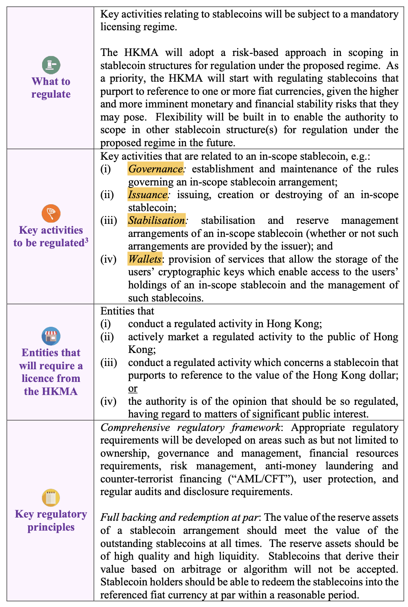

# HongKong Monetary Authority - Conclusion of Discussion Paper on Crypto-assets and Stablecoins

- 3/31/2022 the monetary authority started to look at regulations in crypto soaces as well as stablecoins

- Key activities to be regulated : Governance, Issuance, Stablilisation, Wallets
  
  
  
  
- Stablecoins that derive their value based on `arbitrage` or `algorithm` will not be accepted

- HKMA issued Discussion Paper at January 2022

- Stable coins have interconnection with the mainstream financial system

- Lessons learned from the stablecoin perspective (FTX collapsed, etc.):

  `the events have revealed certain vulnerabilities or even failures in multiple aspects including governance, management, stabilisation mechanisms, transparency and disclosure to users`

  `Certain financial activities related to crypto-asset and/or stablecoins carry similar risks as conventional financial services`

- In October 2022, the FSB, in consultation with relevant international SSBs and international organisations, published a proposed framework for the international regulation of crypto-asset activities

- Regulatory efforts are moving towards the direction that a stablecoin should not rely on arbitrage activities to maintain a stable value at all times and should not derive its value from algorithms (Example of major convergence aspects)

- Crucial elements of the regulatory regime :

  1. *Comprehensive regulatory framework:* The regulatory requirements should cover a broad range of issues including but not limited to ownership, governance and management, financial resources requirements, risk management, AML/CFT, user protection, and regular audits and disclosure requirements

  2. *Full backing and redemption at par:* The value of the reserve assets of a stablecoin arrangement should meet the value of the outstanding stablecoins at all times. The reserve assets should be of high quality and high liquidity. Stablecoins that derive their value based on arbitrage or algorithm will not be accepted. Stablecoin holders should be able to redeem the stablecoins into the referenced fiat currency at par within a reasonable period

  3. *Principal business restriction:* *9* The regulated entities should not conduct activities that deviate from its principal business as permitted under their relevant licence. For example, wallet operators should not engage in lending activities

- In particular, there was broad agreement that the HKMA should regulate stablecoins that have the potential to become a widely accepted means of payment.

- Some advice came from respondents : 

  - `Some respondents shared that central bank digital currencies, certain closed-loop limited purpose stablecoins, settlement tokens, and tokenised deposits of AIs should be excluded from the regulatory scope.`
  - `One respondent also suggested that the HKMA should assess the associated monetary implications of a stablecoin that references its value to the Hong Kong dollar if they were incorporated into the mainstream financial system.`
  - `Entities conducting a stablecoin activity in Hong Kong or actively marketing such an activity to the public of Hong Kong should hold a relevant licence.`
  - `A number of respondents agreed with the HKMA that whether a stablecoin arrangement fell within the definition of an SVF has to be determined on a case-by- case basis, adding that there could be potential overlap between the stablecoin regime and the SVF licensing regime. (SVFs are payment services that enable customers to store funds in a facility for the purpose of making future payments.)`
  - `Several respondents mentioned that the HKMA should consider the interoperability of payment systems, including digital money, both locally and internationally.`

- One interesting question : *Stablecoins could be subject to run and become potential substitutes of bank deposits. Should the HKMA require stablecoin issuers to be AIs under the Banking Ordinance, similar to the recommendations in the Report on Stablecoins issued by the US* *President’s Working Group on Financial Markets?*

- In line with international standards, the HKMA will adopt a risk-based, “same risk, same regulation” approach to regulate the relevant entities and activities.

- The HKMA is of the view that both AIs and non-AIs should be allowed to issue stablecoins as long as they could satisfy relevant licensing and regulatory requirements.

- This one could have a further exploration : A number of respondents expressed that crypto-assets should be regulated in accordance with the international guidance provided by the relevant SSBs.

- With respect to the issue of sandbox, the HKMA has set up a Fintech Supervisory Sandbox that allows banks and their partnering technology firms to conduct pilot trials of their fintech initiatives involving a limited number of participating customers without the need to achieve full compliance with the HKMA's supervisory requirements.

